# Git i Visual Studio Code

Anem a utilitzar GIT desde el Visual Studio Code.

## Inicialització d'un nou repositori

1. Crea una nova carpeta per al teu projecte i obre-la amb VSCode.

    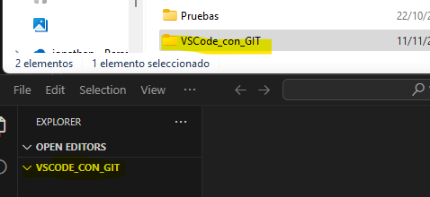

2. Des de la barra d'activitats de l'esquerra, selecciona la icona de control de codi font (Source Control, accessible amb Shift+Ctrl+G).

    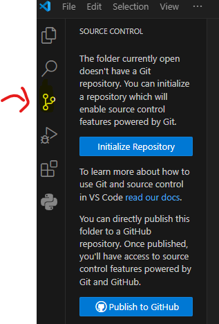

3. Fes clic en "Initialize Repository" per inicialitzar un nou repositori Git en aquesta carpeta.

    

## Afegint fitxers al repositori

1. Crea un nou fitxer anomenat fitxer1.md i afegeix-hi algun contingut.
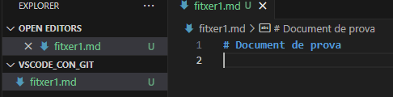

2. Des de la vista de control de codi font, veuràs que el fitxer apareix com a Untracked.

    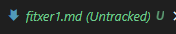

3. Fes clic en el símbol + al costat del fitxer per afegir-lo a l'àrea de preparació (staging area).

    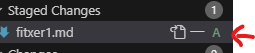

## Fent un commit

1. Escriu un missatge de commit en el camp de text de la vista de control de codi font, per exemple, "Afegit fitxer1.md".

    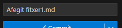

2. Fes clic en el símbol de confirmació (check) per fer el commit, o prem Ctrl+intro

    

## Modificant fitxers i fent nous commits

1. Modifica el contingut de fitxer1.md.

    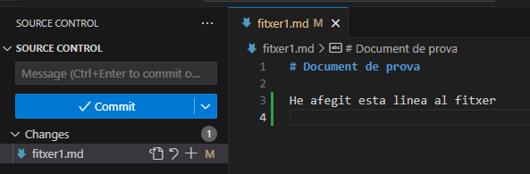

2. Afegeix els canvis a l'àrea de preparació i fes un nou commit amb un missatge descriptiu.

    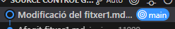

## Esborrant archius

1. Crea un fitxer a la carpeta del prjecte (des de terminal o des de VSCode) anomenat tmp3.md amb un contingut qualsevol, afig-lo al control de canvis i fes el corresponent commit.

    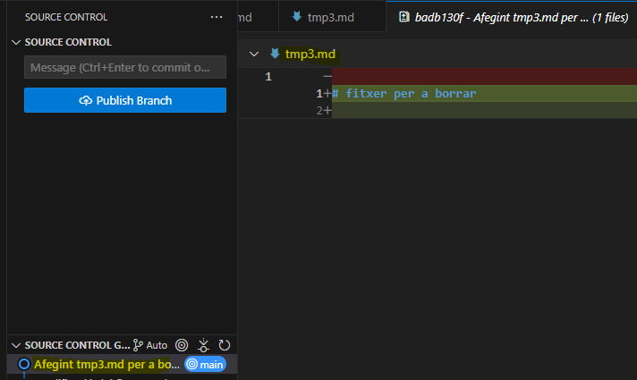

2. Des de l'explorador de fitxers de VSCode, selecciona el fitxer que vols esborrar i fes clic amb el botó dret del ratolí.

3. Selecciona l'opció "Delete" per esborrar el fitxer (o directament prem el botó de suprimir).

4. Ves a la vista de Control de codi font, i veuràs que el fitxer apareix com a "Deleted". Fes clic en el símbol + al costat del fitxer per afegir-lo a l'àrea de preparació (staging area).

    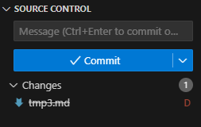

5. Escriu un missatge de commit en el camp de text de la vista de control de codi font, per exemple, "Esborrat fitxer tmp3.md".

6. Fes clic en el boto de confirmació per fer el commit.

    

## Reanomenant

1. Crea un fitxer tmp4.md a la carpeta de treball des de VSCode, afig-lo al control de versions i fes el commit corresponents.

    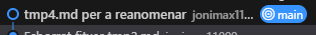

2. En l'explorador de fitxers, fes clic sobre ell amb el botó dret, i seleccoina l'opció "Rename", o directament prem la tecla F2.

3. Canvia-li el nom, per exemple a tmp5.md.

4. Des de la vista de control de codi font, voràs que el fitxer amb el nom anterior tmp4.md apareix com a D - Deleted, i el fitxer amb el nom nou apareix com a U - Untracked. Observa que a la icona d'aquesta vista, ens indica que hi ha dos canvis, no un (és a dir, en lloc d'un renomenat, elimina un fitxer i afig l'altre).

    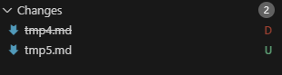

5. Fes clic en el símbol + al costat del fitxer nou per afegir-lo a l'àrea de preparació (staging area) i al fitxer tmp3.md per confirmar l'eliminació del fitxer amb el nom antic.

6. Escriu un missatge de commit, per exemple, "Reanomenat tmp4.md a tmp5.md".

7. Fes clic en el botó de confirmació per fer el commit.

    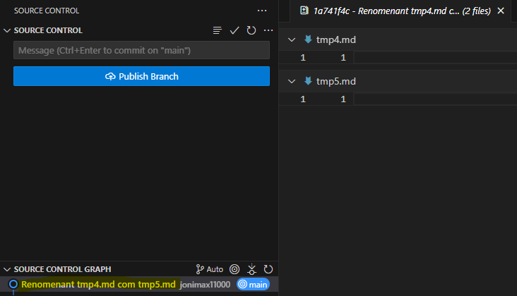

## Eliminant arxius no seguits

1. Creem tmp6.md:

    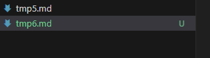

2. Descartem tmp6.md:

    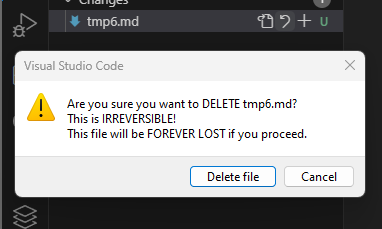
