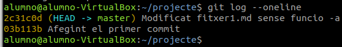
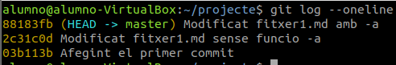

# Exercici 1. Prova a modificar el fitxer i observa els canvis en l'estat

1. Modificarem el fitxer amb un editor com vim. (He possat "hola")
2. Comprobem l'estat.

```
    alumno@alumno-VirtualBox:~/projecte$ git status
    En la rama master
    Cambios no rastreados para el commit:
    (usa "git add <archivo>..." para actualizar lo que será confirmado)
    (usa "git restore <archivo>..." para descartar los cambios en el directorio de trabajo)
        modificados:     fitxer1.md

    Archivos sin seguimiento:
    (usa "git add <archivo>..." para incluirlo a lo que será confirmado)
        .fitxer1.md.swp

    sin cambios agregados al commit (usa "git add" y/o "git commit -a")
```

## En quin estat es trobarà ara l'arxiu? Què haurem de fer perquè els canvis es reflectisquen en el repositori?

Està en seguiment i modificat, però no es troba preparat per al commit.

Faltariá prepararlo amb un *add* i ja es podria fer un *commit*.

```
    alumno@alumno-VirtualBox:~/projecte$ git add fitxer1.md
    warning: LF será reemplazado por CRLF en fitxer1.md.
    El archivo tendrá sus finales de línea originales en tu directorio de trabajo
    alumno@alumno-VirtualBox:~/projecte$ git commit -m "Modificat fitxer1.md sense funcio -a"
    [master 2c31c0d] Modificat fitxer1.md sense funcio -a
    1 file changed, 1 insertion(+)
```



## Investiga sobre el paràmetre -a de l'ordre git commit i intenta relacionar-lo amb aquest exercici

El paràmetre -a serveix per a que el *commit* faça el *add* automàticament. Per a ficar un exemple he tornat a modificar el fitxer.

```
    alumno@alumno-VirtualBox:~/projecte$ git commit -a -m "Modificat fitxer1.md amb -a"
    warning: LF será reemplazado por CRLF en fitxer1.md.
    El archivo tendrá sus finales de línea originales en tu directorio de trabajo
    [master 88183fb] Modificat fitxer1.md amb -a
    1 file changed, 1 insertion(+)
```


