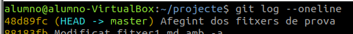

# Exercici 2. Crea dos fitxers, anomenats tmp1.md i tmp2.md i afegeix-los dins del repositori, comprovant l’estat en cada pas, i verificant que estan en el repositori

Durant tota la realització del exercici, a part dels dos archius que ens demanen, apareixerà un tercer archiu, que es el utilitzat en el apartat de [Començant a treballar amb repositoris](treballantRepositoris.md)

1. En primer lloc, crearem, dins del repositori, dos arxius per esborrar posteriorment:

    ```alumno@alumno-VirtualBox:~/projecte$ touch tmp1.md tmp2.md```

    ```
    alumno@alumno-VirtualBox:~/projecte$ ls -l
    total 4
    -rw-rw-r-- 1 alumno alumno 10 oct 29 12:07 fitxer1.md
    -rw-rw-r-- 1 alumno alumno  0 nov 11 09:28 tmp1.md
    -rw-rw-r-- 1 alumno alumno  0 nov 11 09:28 tmp2.md
    ```

2. Comprobem l'estat.

    ```
    alumno@alumno-VirtualBox:~/projecte$ git status
    En la rama master
    Archivos sin seguimiento:
    (usa "git add <archivo>..." para incluirlo a lo que será confirmado)
        .fitxer1.md.swp
        tmp1.md
        tmp2.md
    no hay nada agregado al commit pero hay archivos sin seguimiento presentes (usa "git add" para hacerles seguimiento)
    ```

3. Afegim els documents:

    ```alumno@alumno-VirtualBox:~/projecte$ git add .```

4. Comprovem l'estat altra volta:

    ```
    alumno@alumno-VirtualBox:~/projecte$ git status
    En la rama master
    Cambios a ser confirmados:
    (usa "git restore --staged <archivo>..." para sacar del área de stage)
        nuevos archivos: .fitxer1.md.swp
        nuevos archivos: tmp1.md
        nuevos archivos: tmp2.md
    ```

5. Ara fem el commit:

    ```
    alumno@alumno-VirtualBox:~/projecte$ git  commit -a -m "Afegint dos fitxers de prova"
    [master 48d89fc] Afegint dos fitxers de prova
     3 files changed, 0 insertions(+), 0 deletions(-)
     create mode 100644 .fitxer1.md.swp
     create mode 100644 tmp1.md
     create mode 100644 tmp2.md
    ```


