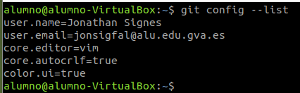

# Instalació de GIT en máquina virtaul Ubuntu

Venvinguts a la tarea de instalar Git en una màquina Ubuntu, açò es degut al fet de que ja tinc i utilitze Git en el meu equip:

## Instalació

1. Refresquem la llista de paquets
```$ sudo apt update```
2. Instalem el paquet:
```$ sudo apt install git```

## Comprovant la versió

Comandament: ```git --version```.

En el meu cas ha eicxit:```git version 2.34.1```.

## Consultant l'ajuda

Comandament: ```$ git help ordre```

## Configurant git

1. Commandaments generals:
    1. Comandament general per a establir un paràmetre: ```$ git config --global paràmetre valor```.
    2. Commandament general per a consultar un paràmetre: ```$ git config --global paràmetre```.
2. Configuració concreta:
    1. Identitat de l’usuari, que es compon del nom i el correu electrònic:

        ```$ git config --global user.name "Jonathan Signes"```

        ```$ git config --global user.email jonsigfal@alu.edu.gva.es```

    2. Editor predeterminat:
        ```$ git config --global core.editor vim```
    3. Perquè utilitze l'eixida en colors significatius:
        ```$ git config --global color.ui true```
    4. Per indicar a git que realitze conversions entre finals de línia quan treballem en entorns híbrids Linux / Windows / Mac:
        ```$ git config --global core.autocrlf true```
    5. Per a consultar la llista de paràmetres.
        ```$ git config --list```
        
