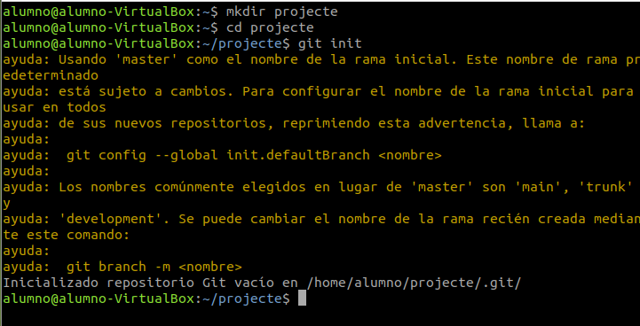
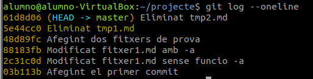
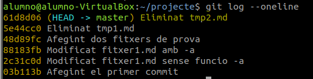
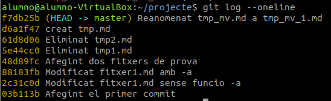
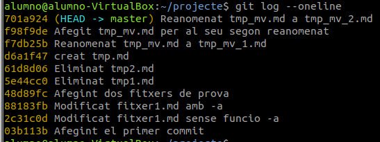
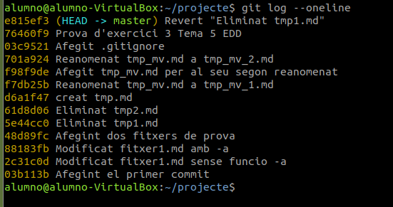

# Començant a treballar amb repositoris

Ara anem a treballar amb el Git desde el Ubuntu.

## Creació i inicialització de la carpeta del projecte

1. **Creem la carpeta del projecte:**

    ```$ mkdir projecte```

2. **En situem dins:**

    ```$ cd projecte```

3. **Inicialitzem el repositori en la carpeta:**

    ```$ git init```

    

4. **Vore el estat del repositori:**

```$ git status```

```
    En la rama master

    No hay commits todavía

    no hay nada para confirmar (crea/copia archivos y usa "git add" para hacerles seguimiento)
```

## Creació de contingut

1. **Comandament:**

    ```$ touch fitxer1.md```.

2. **Estat:**

```
    alumno@alumno-VirtualBox:~/projecte$ git status
    En la rama master

    No hay commits todavía

    Archivos sin seguimiento:
    (usa "git add <archivo>..." para incluirlo a lo que será confirmado)
        fitxer1.md

    no hay nada agregado al commit pero hay archivos sin seguimiento presentes (usa "git add" para hacerles seguimiento)
```

## Fent el seguiment de l’arxiu

1. **Comandament:** ```$ git add fitxer1.md```.

2. **Estado:**

        alumno@alumno-VirtualBox:~/projecte$ git status
        En la rama master
        No hay commits todavía
        Cambios a ser confirmados:
            (usa "git rm --cached <archivo>..." para sacar del área de stage)
                nuevos archivos: fitxer1.md

## Fent el commit del fitxer

1. **Comandament:** ```$ git commit -m "Afegint el primer commit"```.

        alumno@alumno-VirtualBox:~/projecte$ git commit -m "Afegint el primer commit"
        [master (commit-raíz) 03b113b] Afegint el primer commit
            1 file changed, 0 insertions(+), 0 deletions(-)
            create mode 100644 fitxer1.md
        

2. **Estado:**

            alumno@alumno-VirtualBox:~/projecte$ git status
            En la rama master
            nada para hacer commit, el árbol de trabajo está limpio
        

3. **Registre de Commits:** ```$ git log```

            alumno@alumno-VirtualBox:~/projecte$ git log
            commit 03b113bc8558079752319467be406222bbabd4e0 (HEAD -> master)
            Author: Jonathan Signes <jonsigfal@alu.edu.gva.es>
            Date:   Tue Oct 29 09:43:59 2024 +0100

                Afegint el primer commit

4. **Registre de Commits en una linea:** ```$ git log --oneline```

    

## Esborrant archius

Per exemplificar això, partirem dels fitxers tmp1.md i tmp2.md creats en [l'exercici 2](exercici2.md).

En l'exemple esborrarem el fitxer tmp1.md.

1. **Eliminem el filtxer localment, en la zona de treball:**

    ```$ rm tmp1.md```

    Ara observem l'estat:

        alumno@alumno-VirtualBox:~/projecte$ git status
        En la rama master
        Cambios no rastreados para el commit:
        (usa "git add/rm <archivo>..." para actualizar a lo que se le va a hacer commit)
        (usa "git restore <archivo>..." para descartar los cambios en el directorio de trabajo)
            borrados:        tmp1.md

        sin cambios agregados al commit (usa "git add" y/o "git commit -a")

2. **Preparem la següent confirmació:**

    ```$ git add tmp1.md```

    Ara observem l'estat:

        alumno@alumno-VirtualBox:~/projecte$ git status
        En la rama master
        Cambios a ser confirmados:
        (usa "git restore --staged <archivo>..." para sacar del área de stage)
            borrados:        tmp1.md

3. **Confirmar els canvis:**

        alumno@alumno-VirtualBox:~/projecte$ git commit -m "Eliminat tmp1.md"
        [master 5e44cc0] Eliminat tmp1.md
        1 file changed, 0 insertions(+), 0 deletions(-)
        delete mode 100644 tmp1.md

    
    Està la imatge del commit següent perque se me havia olvidat ferla.

## Esborrat directament del repositori

1. **Eliminem el fitxer del repositori**

    ```$ rm tmp1.md```

    Ara observem l'estat:

        alumno@alumno-VirtualBox:~/projecte$ git status
        En la rama master
        Cambios no rastreados para el commit:
        (usa "git add/rm <archivo>..." para actualizar a lo que se le va a hacer commit)
        (usa "git restore <archivo>..." para descartar los cambios en el directorio de trabajo)
            borrados:        tmp1.md

        sin cambios agregados al commit (usa "git add" y/o "git commit -a")

2. **Confirmem els canvis:**

        alumno@alumno-VirtualBox:~/projecte$ git commit -m "Eliminat tmp2.md"
        [master 61d8d06] Eliminat tmp2.md
        1 file changed, 0 insertions(+), 0 deletions(-)
        delete mode 100644 tmp2.md

    Ara observem l'estat:

        alumno@alumno-VirtualBox:~/projecte$ git status
        En la rama master
        Cambios a ser confirmados:
        (usa "git restore --staged <archivo>..." para sacar del área de stage)
            borrados:        tmp2.md

    

## Movent arxius

### Reanomenat local i extensió al repositori

1. **Creant i afegint fitxer**

        alumno@alumno-VirtualBox:~/projecte$ touch tmp_mv.md
        alumno@alumno-VirtualBox:~/projecte$ git add tmp_mv.md
        alumno@alumno-VirtualBox:~/projecte$ git commit -m "creat tmp.md"
        [master d6a1f47] creat tmp.md
        1 file changed, 0 insertions(+), 0 deletions(-)
        create mode 100644 tmp_mv.md

2. **Reanomenat local**

    ```alumno@alumno-VirtualBox:~/projecte$ mv tmp_mv.md tmp_mv_1.md```

    Ara observem l'estat:

        alumno@alumno-VirtualBox:~/projecte$ git status
        En la rama master
        Cambios no rastreados para el commit:
        (usa "git add/rm <archivo>..." para actualizar a lo que se le va a hacer commit)
        (usa "git restore <archivo>..." para descartar los cambios en el directorio de trabajo)
            borrados:        tmp_mv.md

        Archivos sin seguimiento:
        (usa "git add <archivo>..." para incluirlo a lo que será confirmado)
            tmp_mv_1.md

        sin cambios agregados al commit (usa "git add" y/o "git commit -a")

3. **Afegir nous fitxers i canvis al següent commit:**

    1. Afegim l'esborrat:

        ```alumno@alumno-VirtualBox:~/projecte$ git add tmp_mv.md```

    2. Afegim el nou fitxer al control de versions:

        ```alumno@alumno-VirtualBox:~/projecte$ git add tmp_mv_1.md```

    3. Estat:

                alumno@alumno-VirtualBox:~/projecte$ git status
                En la rama master
                Cambios a ser confirmados:
                (usa "git restore --staged <archivo>..." para sacar del área de stage)
                    renombrados:     tmp_mv.md -> tmp_mv_1.md

4. **Confirmem els canvis**

        alumno@alumno-VirtualBox:~/projecte$ git commit -m "Reanomenat tmp_mv.md a tmp_mv_1.md"
        [master f7db25b] Reanomenat tmp_mv.md a tmp_mv_1.md
        1 file changed, 0 insertions(+), 0 deletions(-)
        rename tmp_mv.md => tmp_mv_1.md (100%)

    

### Reanomenat directe en el repositori

1. **Creant i afegint fitxer**

        alumno@alumno-VirtualBox:~/projecte$ touch tmp_mv.md
        alumno@alumno-VirtualBox:~/projecte$ git add tmp_mv.md
        alumno@alumno-VirtualBox:~/projecte$ git commit -m "Afegit tmp_mv.md per al seu segon reanomenat"
        [master f98f9de] Afegit tmp_mv.md per al seu segon reanomenat
        1 file changed, 0 insertions(+), 0 deletions(-)
        create mode 100644 tmp_mv.md

2. **Movem directament el fitxer en el SCV**

    ```alumno@alumno-VirtualBox:~/projecte$ git mv tmp_mv.md tmp_mv_2.md```

    Ara observem l'estat:

        alumno@alumno-VirtualBox:~/projecte$ git status
        En la rama master
        Cambios a ser confirmados:
        (usa "git restore --staged <archivo>..." para sacar del área de stage)
            renombrados:     tmp_mv.md -> tmp_mv_2.md

3. **Confirmant els canvis:**

        alumno@alumno-VirtualBox:~/projecte$ git commit -m "Reanomenat tmp_mv.md a tmp_mv_2.md"
        [master 701a924] Reanomenat tmp_mv.md a tmp_mv_2.md
        1 file changed, 0 insertions(+), 0 deletions(-)
        rename tmp_mv.md => tmp_mv_2.md (100%)

    

## Desfent canvis entre la zona de preparació i treball

1. **Modifiquem el fitxer tmp_mv_1.md**

    ```alumno@alumno-VirtualBox:~/projecte$ echo "Prova per desfer canvis" >> tmp_mv_1.md```

2. **Consultem l'estat del SCV**

        alumno@alumno-VirtualBox:~/projecte$ git status
        En la rama master
        Cambios no rastreados para el commit:
        (usa "git add <archivo>..." para actualizar lo que será confirmado)
        (usa "git restore <archivo>..." para descartar los cambios en el directorio de trabajo)
            modificados:     tmp_mv_1.md

        sin cambios agregados al commit (usa "git add" y/o "git commit -a")

3. **Desfem els canvis**

        alumno@alumno-VirtualBox:~/projecte$ git restore tmp_mv_1.md
        alumno@alumno-VirtualBox:~/projecte$ git status
        En la rama master
        nada para hacer commit, el árbol de trabajo está limpio

## Altres operacions d’interès

### Ignorant fitxers en git. El fitxer .gitignore

El fitxer .gitignore serveix per a especificar patrons de noms d'arxius que no volem guardar en el repositori. Aquest fitxer té que estar en l'arrel del directori de treball.

Regles:

* Cada línia contindrà un patró.
* S’admeten línies en blanc com a separador per millorar la llegibilitat.
* Els comentaris comencen amb #.
* El prefix ! nega el patró (farà que sí incloguen a git els arxius indicats).
* Podem utilitzar el comodí * per indicar qualsevol cadena de caràcters.
* Podem utilitzar la interrogació (?) per reemplaçar un caràcter qualsevol.
* Podem utilitzar expressions regulars tipus [0-9], [ao].

Exemple:

```gitignore
# Ignorar els fitxers amb nom temporal_6.txt i temporal_7.zip
temporal_6.txt
temporal_7.zip

# Ignorar els fitxers amb extensió zip, gz, changes o deb:
*.zip
*.gz
*.changes
*.deb

# Ignorar els fitxers amb extensió .log de la carpeta log, així
# com les extensions .log0, .log1, log2...
log/*.log
log/*.log[0-9]

# Ignorar tots els fitxers del directori imatges
imatges/*

# Ignorar tots els fitxers que acaben en 'a' o 'o' de la 
# carpeta compilats
compilats/*[ao]
```

### Revertir a l’estat d’un commit

1. Estat actual:

        alumno@alumno-VirtualBox:~/projecte$ git log --oneline
        76460f9 (HEAD -> master) Prova d'exercici 3 Tema 5 EDD
        03c9521 Afegit .gitignore
        701a924 Reanomenat tmp_mv.md a tmp_mv_2.md
        f98f9de Afegit tmp_mv.md per al seu segon reanomenat
        f7db25b Reanomenat tmp_mv.md a tmp_mv_1.md
        d6a1f47 creat tmp.md
        61d8d06 Eliminat tmp2.md
        5e44cc0 Eliminat tmp1.md
        48d89fc Afegint dos fitxers de prova
        88183fb Modificat fitxer1.md amb -a
        2c31c0d Modificat fitxer1.md sense funcio -a
        03b113b Afegint el primer commit

2. Revertir el commit: Us del codi ```$ git revert```

        alumno@alumno-VirtualBox:~/projecte$ git log --oneline
        e815ef3 (HEAD -> master) Revert "Eliminat tmp1.md"
        76460f9 Prova d'exercici 3 Tema 5 EDD
        03c9521 Afegit .gitignore
        701a924 Reanomenat tmp_mv.md a tmp_mv_2.md
        f98f9de Afegit tmp_mv.md per al seu segon reanomenat
        f7db25b Reanomenat tmp_mv.md a tmp_mv_1.md
        d6a1f47 creat tmp.md
        61d8d06 Eliminat tmp2.md
        5e44cc0 Eliminat tmp1.md
        48d89fc Afegint dos fitxers de prova
        88183fb Modificat fitxer1.md amb -a
        2c31c0d Modificat fitxer1.md sense funcio -a
        03b113b Afegint el primer commit

### Eliminant arxius no seguits

L'order ```$ git clean -f``` elimina arxius que no estiguen en el control de version encara.

        alumno@alumno-VirtualBox:~/projecte$ git status
        En la rama master
        Archivos sin seguimiento:
        (usa "git add <archivo>..." para incluirlo a lo que será confirmado)
            .fitxer1.md.swo
            f1
            f2
            f3

        no hay nada agregado al commit pero hay archivos sin seguimiento presentes (usa "git add" para hacerles seguimiento)
        alumno@alumno-VirtualBox:~/projecte$ git clean -f
        Borrando .fitxer1.md.swo
        Borrando f1
        Borrando f2
        Borrando f3
        alumno@alumno-VirtualBox:~/projecte$ git status
        En la rama master
        nada para hacer commit, el árbol de trabajo está limpio

Però per a eliminar directoris, tindrem que afegir -d a l'ordre.

        alumno@alumno-VirtualBox:~/projecte$ mkdir dir1 dir2
        alumno@alumno-VirtualBox:~/projecte$ git clean -f -d
        Borrando dir1/
        Borrando dir2/

## Exercici

### git log

        alumno@alumno-VirtualBox:~/projecte$ git log
        commit e815ef3449cdd83b9c2b5a5a27615fa2bf375fad (HEAD -> master)
        Author: Jonathan Signes <jonsigfal@alu.edu.gva.es>
        Date:   Sun Dec 8 16:54:56 2024 +0100

            Revert "Eliminat tmp1.md"
            
            This reverts commit 5e44cc039c4609cbabaf23ac4c5fef16f1ac3c88.
            
            Revert "esborrat tmp1"

        commit 76460f9936d5e0e9b94db0bffd287e3963765ba3
        Author: Jonathan Signes <jonsigfal@alu.edu.gva.es>
        Date:   Sun Dec 8 16:47:34 2024 +0100

            Prova d'exercici 3 Tema 5 EDD

        commit 03c9521577d2c9b7f2fc51c6f62a7902dcfa763d
        Author: Jonathan Signes <jonsigfal@alu.edu.gva.es>
        Date:   Mon Nov 11 21:05:03 2024 +0100

            Afegit .gitignore

        commit 701a924ef8aeb4981065700f153682257da8667a
        :...skipping...
        commit e815ef3449cdd83b9c2b5a5a27615fa2bf375fad (HEAD -> master)
        Author: Jonathan Signes <jonsigfal@alu.edu.gva.es>
        Date:   Sun Dec 8 16:54:56 2024 +0100

            Revert "Eliminat tmp1.md"
            
            This reverts commit 5e44cc039c4609cbabaf23ac4c5fef16f1ac3c88.
            
            Revert "esborrat tmp1"

        commit 76460f9936d5e0e9b94db0bffd287e3963765ba3
        Author: Jonathan Signes <jonsigfal@alu.edu.gva.es>
        Date:   Sun Dec 8 16:47:34 2024 +0100

            Prova d'exercici 3 Tema 5 EDD

        commit 03c9521577d2c9b7f2fc51c6f62a7902dcfa763d
        Author: Jonathan Signes <jonsigfal@alu.edu.gva.es>
        Date:   Mon Nov 11 21:05:03 2024 +0100

            Afegit .gitignore

        commit 701a924ef8aeb4981065700f153682257da8667a
        Author: Jonathan Signes <jonsigfal@alu.edu.gva.es>
        Date:   Mon Nov 11 13:48:03 2024 +0100

            Reanomenat tmp_mv.md a tmp_mv_2.md

        commit f98f9dea30fc76ee8c5d9855fbf18b20dac39231
        Author: Jonathan Signes <jonsigfal@alu.edu.gva.es>
        Date:   Mon Nov 11 13:41:31 2024 +0100

            Afegit tmp_mv.md per al seu segon reanomenat

        commit f7db25be6e6f810108f84e2a07714dae1e209529
        Author: Jonathan Signes <jonsigfal@alu.edu.gva.es>
        ...skipping...
        Author: Jonathan Signes <jonsigfal@alu.edu.gva.es>
        Date:   Sun Dec 8 16:54:56 2024 +0100

            Revert "Eliminat tmp1.md"
            
            This reverts commit 5e44cc039c4609cbabaf23ac4c5fef16f1ac3c88.
            
            Revert "esborrat tmp1"

        commit 76460f9936d5e0e9b94db0bffd287e3963765ba3
        Author: Jonathan Signes <jonsigfal@alu.edu.gva.es>
        Date:   Sun Dec 8 16:47:34 2024 +0100

            Prova d'exercici 3 Tema 5 EDD

        commit 03c9521577d2c9b7f2fc51c6f62a7902dcfa763d
        Author: Jonathan Signes <jonsigfal@alu.edu.gva.es>
        Date:   Mon Nov 11 21:05:03 2024 +0100

            Afegit .gitignore

        commit 701a924ef8aeb4981065700f153682257da8667a
        Author: Jonathan Signes <jonsigfal@alu.edu.gva.es>
        Date:   Mon Nov 11 13:48:03 2024 +0100

            Reanomenat tmp_mv.md a tmp_mv_2.md

        commit f98f9dea30fc76ee8c5d9855fbf18b20dac39231
        Author: Jonathan Signes <jonsigfal@alu.edu.gva.es>
        Date:   Mon Nov 11 13:41:31 2024 +0100

            Afegit tmp_mv.md per al seu segon reanomenat

        commit f7db25be6e6f810108f84e2a07714dae1e209529
        Author: Jonathan Signes <jonsigfal@alu.edu.gva.es>
        Date:   Mon Nov 11 13:36:02 2024 +0100

            Reanomenat tmp_mv.md a tmp_mv_1.md

        commit d6a1f4798b5fd5734cbe588945d8785c4feda4f3
        Author: Jonathan Signes <jonsigfal@alu.edu.gva.es>
        Date:   Mon Nov 11 13:16:58 2024 +0100

            creat tmp.md

        commit 61d8d06b8735d782f5653dbeec0db907bc7c6878
        Author: Jonathan Signes <jonsigfal@alu.edu.gva.es>
        Date:   Mon Nov 11 12:49:00 2024 +0100

            Eliminat tmp2.md

        commit 5e44cc039c4609cbabaf23ac4c5fef16f1ac3c88
        Author: Jonathan Signes <jonsigfal@alu.edu.gva.es>
        Date:   Mon Nov 11 12:38:59 2024 +0100

            Eliminat tmp1.md

        commit 48d89fc7c215b2ec55cd0cb0b2f0ec822b505801
        Author: Jonathan Signes <jonsigfal@alu.edu.gva.es>
        Date:   Mon Nov 11 09:50:42 2024 +0100

            Afegint dos fitxers de prova

        commit 88183fbbeaf853a0effcd6708fcbf2aad290a1a9
        Author: Jonathan Signes <jonsigfal@alu.edu.gva.es>
        Date:   Tue Oct 29 12:08:16 2024 +0100

            Modificat fitxer1.md amb -a

        commit 2c31c0d60c0330b2e05b2d873700f036b3fae3a3
        Author: Jonathan Signes <jonsigfal@alu.edu.gva.es>
        Date:   Tue Oct 29 11:58:00 2024 +0100

            Modificat fitxer1.md sense funcio -a

        commit 03b113bc8558079752319467be406222bbabd4e0
        Author: Jonathan Signes <jonsigfal@alu.edu.gva.es>
        Date:   Tue Oct 29 09:43:59 2024 +0100

            Afegint el primer commit

### Captura de pantalla de git log --oneline


