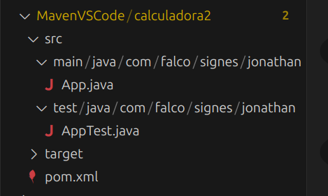
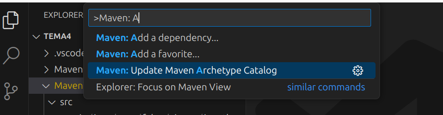
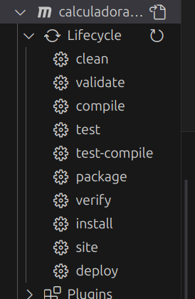
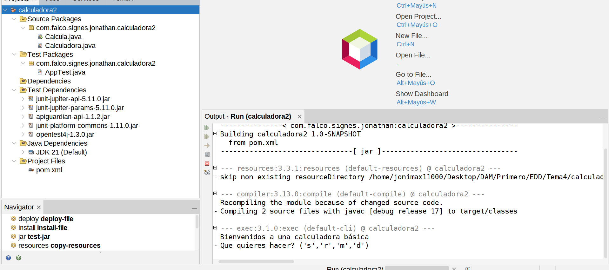

# Maven

## Configura el projecte correctament des de la línia d'ordres, partint del l'arquetip quickstart

```bash
jonimax11000@jonimax11000:~/Desktop/DAM/Primero/EDD/Tema4/MavenQick$ mvn archetype:generate -DgroupId=com.falco.signes.jonathan -DartifactId=calculadoraMaven -DarchetypeArtifactId=maven-archetype-quickstart -DarchetypeVersion=1.5 -DinteractiveMode=false
[INFO] Scanning for projects...
[INFO] 
[INFO] ------------------< org.apache.maven:standalone-pom >-------------------
[INFO] Building Maven Stub Project (No POM) 1
[INFO] --------------------------------[ pom ]---------------------------------
[INFO] 
[INFO] >>> maven-archetype-plugin:3.3.1:generate (default-cli) > generate-sources @ standalone-pom >>>
[INFO] 
[INFO] <<< maven-archetype-plugin:3.3.1:generate (default-cli) < generate-sources @ standalone-pom <<<
[INFO] 
[INFO] 
[INFO] --- maven-archetype-plugin:3.3.1:generate (default-cli) @ standalone-pom ---
[INFO] Generating project in Batch mode
[INFO] ----------------------------------------------------------------------------
[INFO] Using following parameters for creating project from Archetype: maven-archetype-quickstart:1.5
[INFO] ----------------------------------------------------------------------------
[INFO] Parameter: groupId, Value: com.falco.signes.jonathan
[INFO] Parameter: artifactId, Value: calculadoraMaven
[INFO] Parameter: version, Value: 1.0-SNAPSHOT
[INFO] Parameter: package, Value: com.falco.signes.jonathan
[INFO] Parameter: packageInPathFormat, Value: com/falco/signes/jonathan
[INFO] Parameter: junitVersion, Value: 5.11.0
[INFO] Parameter: package, Value: com.falco.signes.jonathan
[INFO] Parameter: groupId, Value: com.falco.signes.jonathan
[INFO] Parameter: artifactId, Value: calculadoraMaven
[INFO] Parameter: javaCompilerVersion, Value: 17
[INFO] Parameter: version, Value: 1.0-SNAPSHOT
[WARNING] Don't override file /home/jonimax11000/Desktop/DAM/Primero/EDD/Tema4/MavenQick/calculadoraMaven/src/main/java/com/falco/signes/jonathan
[WARNING] Don't override file /home/jonimax11000/Desktop/DAM/Primero/EDD/Tema4/MavenQick/calculadoraMaven/src/test/java/com/falco/signes/jonathan
[WARNING] CP Don't override file /home/jonimax11000/Desktop/DAM/Primero/EDD/Tema4/MavenQick/calculadoraMaven/.mvn
[INFO] Project created from Archetype in dir: /home/jonimax11000/Desktop/DAM/Primero/EDD/Tema4/MavenQick/calculadoraMaven
[INFO] ------------------------------------------------------------------------
[INFO] BUILD SUCCESS
[INFO] ------------------------------------------------------------------------
[INFO] Total time:  0.701 s
[INFO] Finished at: 2024-12-09T09:01:01+01:00
[INFO] ------------------------------------------------------------------------
```

```bash
calculadoraMaven
    ├── pom.xml
    ├── src
    │   ├── main
    │   │   └── java
    │   │       └── com
    │   │           └── falco
    │   │               └── signes
    │   │                   └── jonathan
    │   │                       └── App.java
    │   └── test
    │       └── java
    │           └── com
    │               └── falco
    │                   └── signes
    │                       └── jonathan
    │                           └── AppTest.java
    └── target
        ├── classes
        │   └── com
        │       └── falco
        │           └── signes
        │               └── jonathan
        │                   └── App.class
        └── test-classes
            └── com
                └── falco
                    └── signes
                        └── jonathan
                            └── AppTest.class

26 directories, 5 files

```

### Posem el codi de la Calculadora

```bash
calculadoraMaven
    ├── pom.xml
    ├── src
    │   ├── main
    │   │   └── java
    │   │       └── com
    │   │           └── falco
    │   │               └── signes
    │   │                   └── jonathan
    │   │                       ├── Calculadora.java
    │   │                       └── Calcula.java
    │   └── test
    │       └── java
    │           └── com
    │               └── falco
    │                   └── signes
    │                       └── jonathan
    │                           └── AppTest.java
    └── target
        ├── classes
        │   └── com
        │       └── falco
        │           └── signes
        │               └── jonathan
        │                   ├── Calcula.class
        │                   └── Calculadora.class
        └── test-classes
            └── com
                └── falco
                    └── signes
                        └── jonathan
                            └── AppTest.class

26 directories, 7 files
```

### Compilar el projecte

```bash
jonimax11000@jonimax11000:~/Desktop/DAM/Primero/EDD/Tema4/MavenQick/calculadoraMaven$ mvn compile
[INFO] Scanning for projects...
[INFO] 
[INFO] -------------< com.falco.signes.jonathan:calculadoraMaven >-------------
[INFO] Building calculadoraMaven 1.0-SNAPSHOT
[INFO] --------------------------------[ jar ]---------------------------------
[INFO] 
[INFO] --- maven-resources-plugin:3.3.1:resources (default-resources) @ calculadoraMaven ---
[INFO] skip non existing resourceDirectory /home/jonimax11000/Desktop/DAM/Primero/EDD/Tema4/MavenQick/calculadoraMaven/src/main/resources
[INFO] 
[INFO] --- maven-compiler-plugin:3.13.0:compile (default-compile) @ calculadoraMaven ---
[INFO] Recompiling the module because of added or removed source files.
[INFO] Compiling 2 source files with javac [debug release 17] to target/classes
[INFO] ------------------------------------------------------------------------
[INFO] BUILD SUCCESS
[INFO] ------------------------------------------------------------------------
[INFO] Total time:  0.635 s
[INFO] Finished at: 2024-12-09T09:18:00+01:00
[INFO] ------------------------------------------------------------------------
```

```bash
target
    ├── classes
    │   └── com
    │       └── falco
    │           └── signes
    │               └── jonathan
    │                   ├── Calcula.class
    │                   └── Calculadora.class
    ├── generated-sources
    │   └── annotations
    ├── maven-status
    │   └── maven-compiler-plugin
    │       └── compile
    │           └── default-compile
    │               ├── createdFiles.lst
    │               └── inputFiles.lst
    └── test-classes
        └── com
            └── falco
                └── signes
                    └── jonathan
                        └── AppTest.class

```

### Execució

```bash
jonimax11000@jonimax11000:~/Desktop/DAM/Primero/EDD/Tema4/MavenQick/calculadoraMaven$ java -cp target/classes com.falco.signes.jonathan.Calcula
Bienvenidos a una calculadora básica
Que quieres hacer? ('s','r','m','d')
m
Cual es el primer número? (entero)
2
Cual es el segundo número? (entero)
3
6

```

### Netetja del projecte

```bash
jonimax11000@jonimax11000:~/Desktop/DAM/Primero/EDD/Tema4/MavenQick/calculadoraMaven$ mvn clean
[INFO] Scanning for projects...
[INFO] 
[INFO] -----------------< com.jonathan.edd:calculadoraMaven >------------------
[INFO] Building calculadoraMaven 1.0-SNAPSHOT
[INFO] --------------------------------[ jar ]---------------------------------
Downloading from central: https://repo.maven.apache.org/maven2/org/apache/maven/plugins/maven-clean-plugin/3.4.0/maven-clean-plugin-3.4.0.pom
Downloaded from central: https://repo.maven.apache.org/maven2/org/apache/maven/plugins/maven-clean-plugin/3.4.0/maven-clean-plugin-3.4.0.pom (5.5 kB at 5.0 kB/s)
Downloading from central: https://repo.maven.apache.org/maven2/org/apache/maven/plugins/maven-plugins/42/maven-plugins-42.pom
Downloaded from central: https://repo.maven.apache.org/maven2/org/apache/maven/plugins/maven-plugins/42/maven-plugins-42.pom (7.7 kB at 38 kB/s)
Downloading from central: https://repo.maven.apache.org/maven2/org/apache/maven/plugins/maven-clean-plugin/3.4.0/maven-clean-plugin-3.4.0.jar
Downloaded from central: https://repo.maven.apache.org/maven2/org/apache/maven/plugins/maven-clean-plugin/3.4.0/maven-clean-plugin-3.4.0.jar (36 kB at 174 kB/s)
[INFO] 
[INFO] --- maven-clean-plugin:3.4.0:clean (default-clean) @ calculadoraMaven ---
[INFO] Deleting /home/jonimax11000/Desktop/DAM/Primero/EDD/Tema4/MavenQick/calculadoraMaven/target
[INFO] ------------------------------------------------------------------------
[INFO] BUILD SUCCESS
[INFO] ------------------------------------------------------------------------
[INFO] Total time:  1.838 s
[INFO] Finished at: 2024-12-09T02:21:37+01:00
[INFO] ------------------------------------------------------------------------
```

```bash
/calculadoraMaven
    ├── pom.xml
    └── src
        ├── main
        │   └── java
        │       └── com
        │           └── falco
        │               └── signes
        │                   └── jonathan
        │                       ├── Calculadora.java
        │                       └── Calcula.java
        └── test
            └── java
                └── com
                    └── falco
                        └── signes
                            └── jonathan
                                └── AppTest.java

```

### Empaquetat

1. **Creació del JAR:**

        jonimax11000@jonimax11000:~/Desktop/DAM/Primero/EDD/Tema4/MavenQick/calculadoraMaven$ mvn package 
        [INFO] Scanning for projects...
        [INFO] 
        [INFO] -------------< com.falco.signes.jonathan:calculadoraMaven >-------------
        [INFO] Building calculadoraMaven 1.0-SNAPSHOT
        [INFO] --------------------------------[ jar ]---------------------------------
        [INFO] 
        [INFO] --- maven-resources-plugin:3.3.1:resources (default-resources) @ calculadoraMaven ---
        [INFO] skip non existing resourceDirectory /home/jonimax11000/Desktop/DAM/Primero/EDD/Tema4/MavenQick/calculadoraMaven/src/main/resources
        [INFO] 
        [INFO] --- maven-compiler-plugin:3.13.0:compile (default-compile) @ calculadoraMaven ---
        [INFO] Recompiling the module because of changed source code.
        [INFO] Compiling 2 source files with javac [debug release 17] to target/classes
        [INFO] 
        [INFO] --- maven-resources-plugin:3.3.1:testResources (default-testResources) @ calculadoraMaven ---


        /calculadoraMaven/
        ├── pom.xml
        ├── src
        │   ├── main
        │   │   └── java
        │   │       └── com
        │   │           └── falco
        │   │               └── signes
        │   │                   └── jonathan
        │   │                       ├── Calculadora.java
        │   │                       └── Calcula.java
        │   └── test
        │       └── java
        │           └── com
        │               └── falco
        │                   └── signes
        │                       └── jonathan
        │                           └── AppTest.java
        └── target
            ├── calculadoraMaven-1.0-SNAPSHOT.jar
            ├── classes
            │   └── com
            │       └── falco
            │           └── signes
            │               └── jonathan
            │                   ├── Calcula.class
            │                   └── Calculadora.class
            ├── generated-sources
            │   └── annotations
            ├── generated-test-sources
            │   └── test-annotations
            ├── maven-archiver
            │   └── pom.properties
            ├── maven-status
            │   └── maven-compiler-plugin
            │       ├── compile
            │       │   └── default-compile
            │       │       ├── createdFiles.lst
            │       │       └── inputFiles.lst
            │       └── testCompile
            │           └── default-testCompile
            │               ├── createdFiles.lst
            │               └── inputFiles.lst
            ├── surefire-reports
            │   ├── com.falco.signes.jonathan.AppTest.txt
            │   └── TEST-com.falco.signes.jonathan.AppTest.xml
            └── test-classes
                └── com
                    └── falco
                        └── signes
                            └── jonathan
                                └── AppTest.class

2. **Executant el JAR:**

```bash
jonimax11000@jonimax11000:~/Desktop/DAM/Primero/EDD/Tema4/MavenQick/calculadoraMaven$ java -cp target/calculadoraMaven-1.0-SNAPSHOT.jar com.falco.signes.jonathan.Calcula
Bienvenidos a una calculadora básica
Que quieres hacer? ('s','r','m','d')
d
Cual es el primer número? (entero)
4
Cual es el segundo número? (entero)
2
2
```

### Empaquetat 2

Primer modifiquem el pom.xml per a indicar la clase principal de l'aplicació.

```bash
<plugin>
          <artifactId>maven-jar-plugin</artifactId>
          <version>3.4.2</version>
          <configuration>
            <archive>
              <manifest>
                <addClasspath>true</addClasspath>
                <mainClass>com.falco.signes.jonathan.Calcula</mainClass>
              </manifest>
            </archive>
          </configuration>
        </plugin>
```

Generem nou JAR.

```bash
jonimax11000@jonimax11000:~/Desktop/DAM/Primero/EDD/Tema4/MavenQick/calculadoraMaven$ mvn clean package
[INFO] Scanning for projects...
[INFO] 
[INFO] -------------< com.falco.signes.jonathan:calculadoraMaven >-------------
[INFO] Building calculadoraMaven 1.0-SNAPSHOT
[INFO] --------------------------------[ jar ]---------------------------------
[INFO] 
[INFO] --- maven-clean-plugin:3.4.0:clean (default-clean) @ calculadoraMaven ---
[INFO] Deleting /home/jonimax11000/Desktop/DAM/Primero/EDD/Tema4/MavenQick/calculadoraMaven/target
[INFO] 
[INFO] --- maven-resources-plugin:3.3.1:resources (default-resources) @ calculadoraMaven ---
[INFO] skip non existing resourceDirectory /home/jonimax11000/Desktop/DAM/Primero/EDD/Tema4/MavenQick/calculadoraMaven/src/main/resources
[INFO] 
[INFO] --- maven-compiler-plugin:3.13.0:compile (default-compile) @ calculadoraMaven ---
[INFO] Recompiling the module because of changed source code.
[INFO] Compiling 2 source files with javac [debug release 17] to target/classes
[INFO] 
[INFO] --- maven-resources-plugin:3.3.1:testResources (default-testResources) @ calculadoraMaven ---
[INFO] skip non existing resourceDirectory /home/jonimax11000/Desktop/DAM/Primero/EDD/Tema4/MavenQick/calculadoraMaven/src/test/resources
[INFO] 
[INFO] --- maven-compiler-plugin:3.13.0:testCompile (default-testCompile) @ calculadoraMaven ---
[INFO] Recompiling the module because of changed dependency.
[INFO] Compiling 1 source file with javac [debug release 17] to target/test-classes
[INFO] 
[INFO] --- maven-surefire-plugin:3.3.0:test (default-test) @ calculadoraMaven ---
[INFO] Using auto detected provider org.apache.maven.surefire.junitplatform.JUnitPlatformProvider
[INFO] 
[INFO] -------------------------------------------------------
[INFO]  T E S T S
[INFO] -------------------------------------------------------
[INFO] Running com.falco.signes.jonathan.AppTest
[INFO] Tests run: 1, Failures: 0, Errors: 0, Skipped: 0, Time elapsed: 0.024 s -- in com.falco.signes.jonathan.AppTest
[INFO] 
[INFO] Results:
[INFO] 
[INFO] Tests run: 1, Failures: 0, Errors: 0, Skipped: 0
[INFO] 
[INFO] 
[INFO] --- maven-jar-plugin:3.4.2:jar (default-jar) @ calculadoraMaven ---
[INFO] Building jar: /home/jonimax11000/Desktop/DAM/Primero/EDD/Tema4/MavenQick/calculadoraMaven/target/calculadoraMaven-1.0-SNAPSHOT.jar
[INFO] ------------------------------------------------------------------------
[INFO] BUILD SUCCESS
[INFO] ------------------------------------------------------------------------
[INFO] Total time:  1.252 s
[INFO] Finished at: 2024-12-09T12:38:27+01:00
[INFO] ------------------------------------------------------------------------
```

Executem:

```bash
jonimax11000@jonimax11000:~/Desktop/DAM/Primero/EDD/Tema4/MavenQick/calculadoraMaven$ java -jar target/calculadoraMaven-1.0-SNAPSHOT.jar 
Bienvenidos a una calculadora básica
Que quieres hacer? ('s','r','m','d')
r
Cual es el primer número? (entero)
8
Cual es el segundo número? (entero)
6
2
```

## Genera el projecte correctament des de VSCde

1. En la carpeta que volem iniciar el projecte, obrim el desplegable de Maven.
2. Creem un projecte nou polsant en new project...
3. En les opcions desplegades seleccionarem el arquetip de quickstart.
4. Indiquem que el projecte està en la versió 1.0, que el grupId es com.falco.signes.jonathan i el nom del projecte com calculadora2.
5. Deixem el valor predeterminat 1.0-SNAPSHOT, i polsem Intro per a crear el projecte.

    

    

6. Posem el code de la calculadora.
7. Ara ja podemo compillar, empaquetar, netetjar, ejecutar,etc. Tot amb un parell de clicks.

    

## Netbeans

1. Polsar **Archivo --> Nuevo proyecto**.
2. Asistent del nou projecte.
    1. Categories: Seleccionem *Java with Maven*.
    2. Projects: Seleccionem *Proyect with Archetype*.
    3. Pulsamos *Next*.
3. En la llista de arquetipes hem buscat: "maven-archetype-quickstart", com hi han varios, he elegit el de la versió 1.5, com en el punt de comands
4. Name and Location:
    1. Elegim el nom del projecte: calculadoreNetbeans.
    2. Elegim la carpeta on s'alojarà el projecte: no relevant.
    3. Group Id: com.falco.signes.jonathan
    4. Version: 1.0-SNAPSHOT.
    5. Package: com.falco.signes.jonathan.calculadora2
5. Finalitzem.
6. Posem la Calculadora.java i Calcula.java en el projecte

    